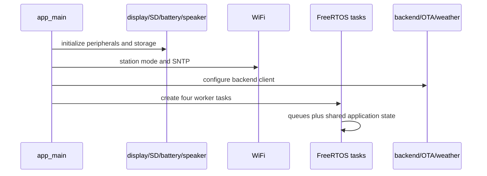
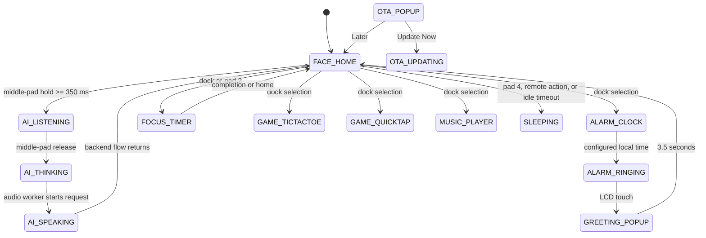
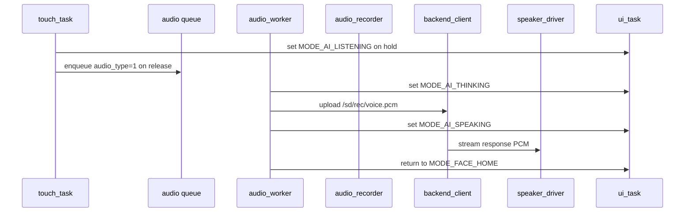

# Architecture

This document describes the current implementation centered on `src/main.c` and the component APIs it invokes.

## System composition

`app_main()` initializes NVS, display, SD card, cached icons, alarm settings, battery ADC, speaker output, Wi-Fi, SNTP, and the backend client. It then creates four long-lived tasks:

1. `audio_worker` handles voice requests and event audio.
2. `touch_task` samples four GPIO inputs and changes interaction state.
3. `ui_task` owns LCD rendering, modes, LCD touch controls, alarms, focus, games, and sleep behavior.
4. `net_task` performs weather, telemetry, action polling, and OTA checks.



## Main mode state machine



The enum also contains `MODE_ANIM_LOVE` and `MODE_ANIM_PIZZA` for short remote-event animations.

## Inter-task communication

`app_main()` creates:

| Queue | Length | Item | Producers | Consumer |
| --- | ---: | --- | --- | --- |
| `s_ui_event_queue` | 8 | `ui_event_t` | `net_task` | `ui_task` |
| `s_audio_upload_queue` | 4 | `audio_req_t` | `touch_task`, `ui_task` | `audio_worker` |

`ui_event_t.event_type` values used by the current processing code are `1` notification, `3` pizza/feed, `4` love/pet, `5` OTA, `6` sleep, and `7` set alarm. The declared value `2` song is not processed in that branch.

Shared static state carries the current mode, Wi-Fi state, alarm, focus timer, media state, relationship metrics, OTA information, and timers. LCD rendering is performed by `ui_task`.

## Voice pipeline



`audio_recorder` provides an `audio_rec_task` that can sample ADC1 channel 3 / GPIO 4, convert values to signed 16-bit PCM, and write `/sd/rec/voice.pcm`. However, the current `main.c` does not include or initialize this component in `app_main()`. The active `audio_worker` calls `backend_client_send_audio_sd()` against `/sd/rec/voice.pcm` with a fixed `16000 * 2 * 3` byte length, so the source of that file is not completed by the current application flow. The file size and fixed upload length should be checked together when changing recording behavior.

## Network flows

### Voice request

`backend_client_send_audio_sd()` uploads raw PCM to `<base_url>/api/emo/chat` over HTTPS, parses `X-Emo-Reply` and `X-Emo-Emotion`, and streams successful HTTP 200 response bytes to the speaker in chunks.

### Action polling

Every second, `net_task` calls `<base_url>/api/emo/poll_action` and parses JSON `{ "action": "..." }`. Recognized values are:

- `SONG:<title>`
- `NOTIF:[app] message`
- `FEED_PIZZA`
- `PET_LOVE`
- `FORCE_SLEEP`
- `SET_ALARM:<hour>:<minute>:<enabled>`
- `CHECK_OTA`

### Telemetry and weather

Every 10 seconds, telemetry posts battery bars, charging state, affection, hunger, and energy to the hardcoded `/api/bot/sync_telemetry` endpoint. Weather is fetched no more often than every 30 minutes from the hardcoded Open-Meteo URL and parsed for `"temperature"`.

## Battery subsystem

`battery_driver` reads ADC2 channel 3 on GPIO 14 through a 100k/47k divider. It uses curve-fitting calibration when available and a raw fallback otherwise. Reads are rate-limited to 1.5 seconds and filtered as:

```text
smoothed = previous * 0.85 + measured * 0.15
```

Bar thresholds are 8.10 V, 7.60 V, 7.20 V, and 6.60 V. Charging is reported at or above 8.20 V; critical state is below 6.60 V. Invalid readings outside 4.5..9.5 V preserve the last known state.

The UI renders bars, a blinking charging marker, or a blinking critical red body. Critical battery state also takes priority in home-face expression selection on alternating ticks.

## OTA subsystem

`net_task` reacts to `CHECK_OTA` by requesting `https://divaan-backend.onrender.com/api/device/manifest.json`. `ota_check_update_info()` expects `version`, `notes`, and `firmware_url`. It compares the manifest version with compiled `v1.2.0`.

The UI displays version and changelog. `UPDATE NOW` creates `ota_worker`, which calls `esp_https_ota()` and restarts after success. `partitions.csv` provides `otadata`, `ota_0`, and `ota_1`. The displayed OTA bar is animated by UI ticks and is not download progress.

## Display and SD architecture

`display_driver` owns LCD SPI, XPT2046-style touch polling, SD-SPI/FATFS mounting, RGB565 rendering, animation loading, notification icons, header caching, and the relationship metrics interface.

- LCD: SPI2, 40 MHz, CS GPIO 10.
- Screen touch: SPI2, 2 MHz, CS GPIO 7.
- SD: shared SPI2, CS GPIO 6, host limit 20 MHz.
- Display: 320x240 RGB565.
- Five 40x40 dock icons are cached in static RAM.
- Eye animation frames use an 88x100 buffer.

`sd_card_init()` does not format a failed card. `sd_card_deinit()` unmounts the card when mounted.

## Application logic

- Alarm settings load from `/sd/metrics/alarm.json`, then NVS namespace `storage`, then default to 07:30 enabled. Saves write both SD and NVS.
- Focus duration changes in five-minute steps from 5 to 90 minutes. Completion returns Home and queues a focus chime.
- Tic-Tac-Toe uses recursive minimax with terminal scores +10 for the AI, -10 for the user, and 0 for a draw.
- Quick Tap awards 10 points and moves the target every 1.5 seconds.
- Home enters Sleeping after 30 minutes of inactivity when focus and music are not active.

## Known limitations

- `emo_metrics_init()` and `emo_metrics_save()` are empty; the in-memory relationship values are not persisted by those functions.
- Direct shared state is used alongside queues; there is no general event bus.
- Backend, weather, telemetry, gateway, and OTA service schemas are outside this repository.
- `groq_stt` and `wifi_bridge` are not the primary active voice/media paths in `main.c`.
