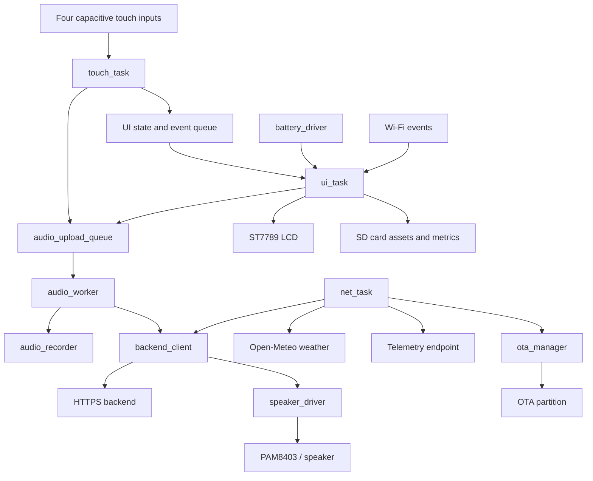

# MiNi Emo Bot / Divaan

MiNi Emo Bot is an ESP32-S3 embedded companion with a touch-driven face UI, SD-card animations and sounds, voice interaction, alarms, focus mode, games, phone media controls, battery monitoring, cloud actions, telemetry, weather, and HTTPS firmware updates.

The current application is implemented in `src/main.c` and uses ESP-IDF components built through PlatformIO. The board target is `esp32-s3-devkitc-1`.

## Features implemented

- ST7789 320x240 LCD over `SPI2_HOST`.
- Four capacitive touch inputs for hold-to-talk, petting, tickle, focus, application cycling, and sleep behavior.
- SD-card storage mounted at `/sd` for animations, icons, sound effects, metrics, and recorded voice.
- SD-backed, 16 kHz ADC microphone recorder component targeting `/sd/rec/voice.pcm`; the current `main.c` voice path uploads that file but does not call the recorder initialization/start API.
- HTTPS voice upload and streamed PCM response playback.
- Home face with time, date, weather, Wi-Fi state, battery icon, and relationship metrics.
- Alarm clock with persistence, ringing screen, and greeting popup.
- Adjustable focus timer with start, pause, resume, reset, and completion chime.
- Local Tic-Tac-Toe minimax AI and Quick Tap game.
- Remote phone media controls through a local gateway/backend.
- Backend action polling, notifications, feeding/love events, sleep commands, alarm updates, and OTA requests.
- Battery ADC monitoring with smoothing, four-level bars, charging indication, and critical-low indication.
- HTTPS OTA update checks and dual application partitions.

## Architecture



| Task | Core | Priority | Responsibility |
| --- | ---: | ---: | --- |
| `audio_worker` | 0 | 5 | Voice upload, streamed response handling, and event sounds |
| `touch_task` | 1 | 5 | Four-pad input sampling and interaction behavior |
| `ui_task` | 1 | 5 | Mode logic, screen rendering, timers, games, alarm, OTA prompt |
| `net_task` | 0 | 4 | Weather, telemetry, backend action polling, and OTA checks |

See [ARCHITECTURE.md](ARCHITECTURE.md) for task, queue, state, storage, and network details.

## Requirements

### Hardware

- ESP32-S3-DevKitC-1
- 320x240 ST7789 LCD
- XPT2046-style resistive touch controller
- Four GPIO capacitive touch inputs
- Analog microphone on GPIO 4
- PAM8403 amplifier input on GPIO 15
- SPI MicroSD card
- Battery voltage divider on GPIO 14 / ADC2 channel 3
- Wi-Fi network

### Software

- PlatformIO Core
- Espressif32 platform
- ESP-IDF framework supplied by PlatformIO

## Build, flash, and monitor

```bash
pio run -e esp32-s3-devkitc-1
pio run -t upload -e esp32-s3-devkitc-1
pio device monitor -b 115200
```

Combined upload and monitor:

```bash
pio run -t upload -t monitor -e esp32-s3-devkitc-1
```

The custom `partitions.csv` defines `ota_0` and `ota_1` application slots.

## Configuration

Runtime settings are in `include/config.h`:

| Definition | Current value | Meaning |
| --- | --- | --- |
| `EMO_WIFI_SSID` | `Aathisivan's Phone` | Wi-Fi SSID |
| `EMO_WIFI_PASSWORD` | source-defined value | Wi-Fi password |
| `EMO_BACKEND_BASE_URL` | `https://divaan-backend.onrender.com` | Main backend |
| `VERCEL_BYPASS_SECRET` | source-defined value | Defined backend-related secret; current use is not visible in the application flow |
| `PIN_NUM_MIC_ADC` | `4` | ADC microphone input |
| `PIN_NUM_SPEAKER_PDM` | `15` | Sigma-Delta audio output |
| `PIN_NUM_SD_CS` | `6` | MicroSD chip select |
| `SD_MOUNT_POINT` | `/sd` | FATFS mount point |
| `AUDIO_SAMPLE_RATE_HZ` | `16000` | Audio sample rate |
| `AUDIO_MAX_RECORD_SEC` | `5` | Maximum configured recording duration |
| `NTP_SERVER` | `pool.ntp.org` | Time synchronization server |
| `TIMEZONE_OFFSET_SEC` | UTC+5:30 expression | Documented timezone offset |

Credentials and endpoint values are compiled into the firmware; they are not loaded from environment variables at runtime.

## SD-card content

```text
/sd/
├── anims/{listen,think,speak,sleep}/00.bin..07.bin
├── icons/dock/{alarm,focus,ttt,tap,music}.bin
├── icons/<notification-app>.bin
├── icons/generic.bin
├── sfx/alarm.pcm
├── sfx/focus_done.pcm
├── metrics/alarm.json
└── rec/voice.pcm
```

Animation frames are raw RGB565, 88x100 pixels. Dock icons are raw RGB565, 40x40 pixels. PCM files are raw audio data. The card is not formatted automatically when mounting fails.

## User interaction

- Middle touch pads held for at least 350 ms enter listening mode; release submits the existing `/sd/rec/voice.pcm` path.
- Double tap on pad 1 or pad 4 generates a left/right tickle event in the reusable touch component.
- A pad sweep `1 -> middle -> 4` or reverse is the documented petting gesture.
- Pad 2 toggles Focus mode when focus is not running.
- Pad 3 cycles home application modes.
- Pad 4 toggles Sleeping mode.
- LCD touch controls operate the dock, alarm, focus timer, games, music player, alarm stop, and OTA prompt.

## Testing

The repository contains no project-specific automated test implementation; `test/README` is the PlatformIO placeholder. The available build validation is:

```bash
pio run -e esp32-s3-devkitc-1
```

Hardware behavior requires a board, display, SD card, sensors, backend, and serial monitor. The current `main.c` does not invoke the `audio_recorder` initialization/start functions, so recording-file creation is not completed by the active startup flow.

## Limitations and implementation notes

- Wi-Fi credentials, backend URLs, OTA manifest URL, weather location, and telemetry URL are hardcoded.
- OTA compares the manifest version with `v1.2.0`; any different version is considered available.
- OTA UI progress is an animated bar, not measured download progress.
- `emo_metrics_init()` and `emo_metrics_save()` are currently empty functions.
- `groq_stt` remains separate from the active voice path.
- `wifi_bridge` exists as a local HTTP media-control component; the active music player uses `backend_client_send_media_cmd()` instead.
- Exact backend contracts beyond the parsed JSON action, `X-Emo-Reply`, `X-Emo-Emotion`, and streamed audio are not specified in this repository.

## Documentation

- [ARCHITECTURE.md](ARCHITECTURE.md): runtime tasks, states, queues, storage, and design decisions.
- [API.md](API.md): public component interfaces and current behavior.
- [SETUP.md](SETUP.md): hardware, SD-card, build, flash, and deployment setup.
- [TROUBLESHOOTING.md](TROUBLESHOOTING.md): practical diagnosis for setup and runtime problems.
